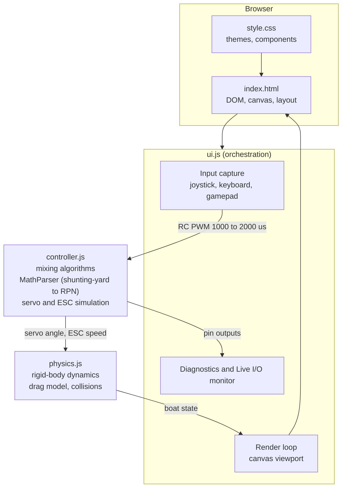

# RC ASD Boat Simulator

A real-time, browser-based simulator for **2-channel and 4-channel RC (Radio Control) Azimuth Stern Drive (ASD) boats**. This tool visualizes how a twin azimuth thruster boat responds to joystick inputs, helping hobbyists and engineers design, test, and tune control mixing algorithms before deploying them to physical hardware.

### [**Try it live: shaunmurphy.github.io/RCASDBoatSimulator**](https://shaunmurphy.github.io/RCASDBoatSimulator/)

**No build tools, frameworks, or dependencies required.** Just open `index.html` in a modern browser, or serve it with any static HTTP server.

## Features

### Real-Time Boat Physics Simulation
- **2D rigid-body dynamics** with mass, inertia, and center-of-gravity modeling
- **Hydrodynamic drag**: linear, lateral, and angular drag coefficients simulate realistic water resistance
- **Twin azimuth thruster model**: each thruster pod has independent servo angle and motor speed, positioned at configurable stern offsets
- **Boundary collision detection** with elastic restitution against the simulation area edges

### Interactive Joystick Control
- **On-screen virtual joystick** with touch and mouse support
- **Keyboard controls**: Arrow keys or WASD for steering and throttle
- **Gamepad support**: plug in a USB or Bluetooth gamepad and control the boat directly
- **Configurable deadzone** filtering for both joystick and gamepad inputs

### Microprocessor Simulation
- Faithfully simulates the signal processing pipeline of an **ESP32 or Arduino microcontroller**:
  - RC PWM input capture (1000 to 2000 us pulse width)
  - Normalized joystick axis conversion
  - Configurable steering inversion
  - Servo rotation speed limiting (slew rate)
  - ESC response lag (first-order time constant)

### Control Mixing Algorithms

Four built-in mixing modes plus user-defined custom algorithms:

| Mode | Description |
|------|-------------|
| **Vectored** | Full ASD vectoring with translation, rotation, and lateral thrust components. Supports toe-in angle, differential speed, and lateral sideways thrust. |
| **Differential** | Classic differential steering: speed difference between left and right motors drives rotation. No lateral thrust vectoring. |
| **Crab Walk** | Lateral translation mixing. Coordinates azimuth pod angles ($k = -d_y / d_x = 4.2667$) to generate sideways sway forces with zero net turning torque. |
| **Custom** | User-defined mathematical equations for all four actuator targets, parsed and evaluated securely without JavaScript execution. |

### 2-Channel and 4-Channel Transmitter Configuration

- **2-Channel Mode**: Standard setup using a single gimbal (Ch1 Steering, Ch2 Throttle).
- **4-Channel Mode**: Advanced setup featuring dual gimbals:
  - **Right Stick**: Steering (Ch1) and Throttle (Ch2).
  - **Left Stick**: Auxiliary sway (Ch3) and spin (Ch4).
  - **Auxiliary Modes**: Map the Left Stick to overlay pure lateral slide (sway) or pure yaw rotation (spin) on top of the primary control superposition vectors.
  - Telemetry readouts and C++ previews automatically expand to support all 4 channels.

### Safe Custom Mixing Equations

Custom algorithms use a **secure mathematical expression parser** (shunting-yard to RPN evaluator) instead of raw JavaScript. This eliminates injection vulnerabilities while providing full mathematical flexibility:

**Available Variables:**
| Variable | Description |
|----------|-------------|
| `x` | Joystick steering axis (-1.0 = left, 1.0 = right) |
| `y` | Joystick throttle axis (-1.0 = reverse, 1.0 = forward) |
| `toeangle` | Active max toe-in angle (radians) |
| `transweight` | Translation mixing weight |
| `rotweight` | Yaw rotation mixing weight |
| `latweight` | Lateral thrust mixing weight |
| `pi` | Math constant pi |

**Supported Operators:** `+` `-` `*` `/` `^` (power) `( )`

**Supported Functions:** `sin(a)` `cos(a)` `tan(a)` `abs(a)` `sqrt(a)` `min(a,b)` `max(a,b)`

### Real-Time Diagnostics HUD
- **Servo angles** and PWM pulse widths for left and right pods
- **ESC speed** percentages and PWM values
- **RC input** pulse width monitoring
- **Visual progress bars** for all actuator channels
- Interactive **help tooltips** on every parameter explaining its function

### Live I/O Monitor
- A virtual ESP32 or Arduino board that mirrors the exact pins the generated firmware drives
- Live per-pin pulse width (us), duty percentage, servo angle, and activity LEDs
- A PWM signal scope that renders each pin's 50 Hz pulse train so pulse widths change as the transmitter sticks move
- Updates every frame from the same mixing outputs that move the simulated boat

### Interactive Map View
- Zoomable top-down map with grid overlay
- Configurable map zoom (px per meter) and boat scale multiplier
- Google Maps-style plus and minus zoom controls
- Optional **clearance outline overlay** showing the boat's physical footprint
- Real-time heading and position tracking

### Arduino and ESP32 Code Preview
- Live-generated C++ code that mirrors the active mixing algorithm
- Platform selector: **ESP32** or **Arduino Uno**
- Embedded first-time setup instructions for installing the toolchain and libraries
- Direct translation of simulator settings to deployable firmware code
- Configurable pin assignments

### UI and UX
- **Dark and Light themes** with smooth transitions
- Modern glassmorphic design with the **Inter** and **JetBrains Mono** font families
- Collapsible sidebar widgets for organized parameter grouping
- Responsive layout

## Quick Start

### Option 1: Open Directly
Simply open `index.html` in any modern browser (Chrome, Firefox, Safari, Edge).

> **Note:** Some browsers block ES module imports from `file://` URLs. If you see a blank page, use Option 2 instead.

### Option 2: Local HTTP Server

```bash
# Python 3
python3 -m http.server 8080

# Node.js
npx serve .

# PHP
php -S localhost:8080
```

Then navigate to `http://localhost:8080`.

## Project Structure

```
index.html       Main application shell: sidebar UI, canvas, modal editor
style.css        Complete design system: dark and light themes, layout, components
controller.js    Microprocessor simulation: mixing algorithms, MathParser, PWM
physics.js       2D rigid-body boat physics: forces, drag, collisions
ui.js            UI orchestration: rendering loop, input handling, diagnostics
LICENSE          Apache License 2.0
```

### Module Architecture



## Configuration Parameters

All parameters are adjustable in real-time via the sidebar UI:

| Parameter | Default | Description |
|-----------|---------|-------------|
| Max Toe-in Angle | 45 deg | Maximum inward angle of thruster pods at idle |
| Servo Speed Limit | 360 deg/s | Maximum angular rotation rate of servo motors |
| Motor Time Constant | 0.15 s | ESC first-order response lag |
| Deadzone | 0.02 | Joystick and gamepad input dead band |
| Translation Weight | 1.0 | Forward and reverse throttle mixing weight |
| Rotation Weight | 0.8 | Yaw differential steering weight |
| Lateral Weight | 0.7 | Sideways thrust vectoring weight (vectored mode) |
| Boat Mass | 5.0 kg | Simulated vessel mass |
| Boat Length | 0.6 m | Hull length for physics and rendering |
| Boat Beam | 0.25 m | Hull width |

## Browser Compatibility

| Browser | Supported |
|---------|-----------|
| Chrome 90+ | Yes |
| Firefox 90+ | Yes |
| Safari 15+ | Yes |
| Edge 90+ | Yes |

Requires ES Modules support and HTML5 Canvas.

## License

This project is licensed under the **Apache License 2.0**. See the [LICENSE](LICENSE) file for details.

## Copyright

Copyright 2026 Shaun Murphy and Charles Murphy
